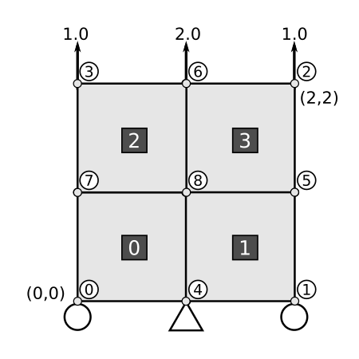
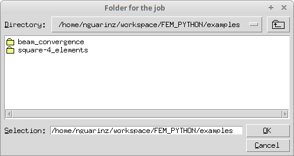

# Finite Element Analysis Code in Python

This project finds the displacement, strain and stress solution for an
arbitrary two-dimensional domain discretized into finite elements and
subjected to point loads. It has been  created for academic purposes
and it is part of the teaching material developed for the courses
IC0602 Introduction to the Finite Element Methods and
IC0285 Computational Modeling at Universidad EAFIT. The code is
written in Python 2 dialect (although, most of it works as well
in Python 3) and it is organized in independent modules for
pre-processing, assembly and post-processing allowing the user to
easily modify it or add features like new elements. In this document
we briefly describe its use, initially through a simple example
corresponding to a square plate under point loads. In a second problem
we show the user how to create a model and visualize results for a
more complex problem using the third-party software [Gmsh](http://gmsh.info/).

## Input files
The code requires the domain to be input in the form of text files
containing the nodes, elements, loads and material information.
These files must reside in the same directory and must have the
names ``eles.txt``, ``nodes.txt``, ``mater.txt`` and ``loads.txt``.
Assume that we want to find the response of the 2×2 square
under unitary vertical point loads shown in the following figure.
Where one corner is located at (0,0) and the opposite one at (2,2).

The file ``nodes.txt``is composed of the following fields:

- Column 0: Nodal identifier (integer).
- Column 1: x-coordinate (float).
- Column 2: y-coordinate (float).
- Column 3: Boundary condition flag along the x-direction
    (0 free, -1 restrained).
- Column 4: Boundary condition flag along the y-direction
    (0 free, -1 restrained).

The corresponding file has the following data

    0  0.00  0.00   0  -1
    1  2.00  0.00   0  -1
    2  2.00  2.00   0   0
    3  0.00  2.00   0   0
    4  1.00  0.00  -1  -1
    5  2.00  1.00   0   0
    6  1.00  2.00   0   0
    7  0.00  1.00   0   0
    8  1.00  1.00   0   0

The file ``eles.txt``contain the element information. Each line in the file
defines the information for a single element and is composed of the
following fields:

- Column 0: Element identifier (integer).
- Column 1: Element type (integer):
  1. 4 nodes quadrilateral.
  2. 6 nodes triangle.
  3. 3 nodes triangle.
- Column 2: Material profile for the current element (integer).
- Column 3 to end: Element connectivity, that is a list of the nodes
conforming each element. The nodes should be listed in counterclockwise
orientation.

The corresponding file has the following data

    0   2   1   0   4   8   7
    1   2   1   4   1   5   8
    2   2   1   7   8   6   3
    3   2   1   8   5   2   6

The file `mater.txt` contain the material information. Each line in the
file corresponds to a material profile to be assigned to the different
elements in the elements file. In this example, there is one material
profile. Each line in the file is composed of the following fields:  

- Column 0: Young's modulus for the current profile (float).
- Column 1: Poisson's ratio for the current profile (float).

The corresponding file has the following data

    1.0  0.3

The file `loads.txt` contains the point loads information. Each line
in the file defines the load information for a single node and is
composed of the following fields

- Column 0: Nodal identifier (integer).
- Column 1: Load magnitude for the current node along the x-direction (float).
- Column 2: Load magnitude for the current node along the y-direction (float).

The corresponding file has the following data

    3  0.0  1.0
    6  0.0  2.0
    2  0.0  1.0

## Executing the program
In a terminal type

    $ python solids_ISO_GUI.py

If you have `easygui` installed a pop-up window will appear for you
to select the folder with the input files

select the folder and click ok.

If you don't have `easygui` installed the software will ask you
for the path to your folder. The path can be absolute or relative.

    Enter folder (empty for the current one):

In this example, the path can be entered as

    Enter folder (empty for the current one): ../examples/square-4_elements/

Then, you will see some information regarding your analysis

    Number of nodes: 9
    Number of elements: 4
    Number of equations: 14
    Duration for system solution: 0:00:00.006895
    Duration for post processing: 0:00:01.466066
    Analysis terminated successfully!

And, once the solution is achieved you will see displacements and
stress solutions as contour plots, like the following

<table>
    <tr>
    <td>
    </img>
    </td>
    <td>
    </img>
    </td>
    </tr>
</table>

### Interactive execution
You can also run the program interactively using a Python terminal,
a good option is [IPython](http://ipython.org/).

In IPython you can run the program with

    In [1]: runfile('solids_ISO_GUI.py')
    Reloaded modules: preprocesor, postprocesor, femutil, gaussutil, assemutil, uelutil, solutil

or just click run (or press F5) if you are using the [Spyder IDE](https://github.com/spyder-ide/spyder).

After running the code we have the nodal variables for post-processing.
For example, we can print the displacement vector

    In [2]: np.set_printoptions(threshold=np.nan)

    In [3]: print(np.round(UG, 3))
    [ 0.6 -0.6 -0.6  4.   0.6  4.  -0.6  2.  -0.   4.   0.6  2.  -0.   2. ]

where we first setup the printing option for IPython to show the full
array and then rounded the array to 3 decimal places.

    In [4]: U_mag = np.sqrt(UG[0::2]**2 + UG[1::2]**2)

    In [5]: print(np.round(U_mag, 3))
    [ 0.849  4.045  4.045  2.088  4.     2.088  2.   ]
