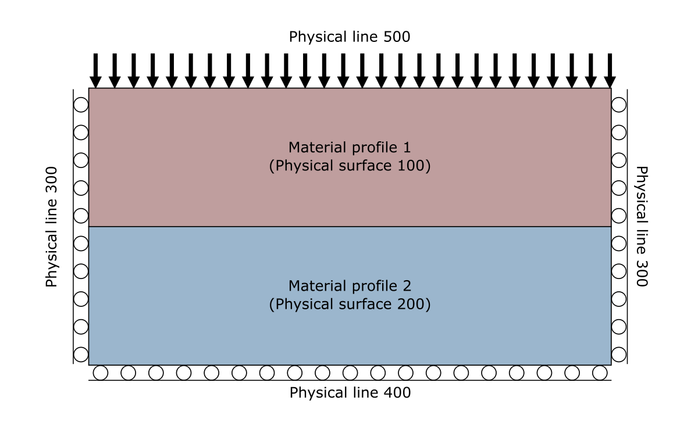

# Creation of a simple geometry using Gmsh

We want to create a mesh for the following geometry



The ``.geo`` file for this model is the following

```c
// Parameters
L = 2.0;
H = 1.0;
h_1 = H/2;
h_2 = H/2;
lado_elem = 0.1;


// Points
Point(1) = {0.0, 0.0, 0, lado_elem};
Point(2) = {L, 0.0, 0, lado_elem};
Point(3) = {L, h_2, 0, lado_elem};
Point(4) = {L, H, 0, lado_elem};
Point(5) = {0, H, 0, lado_elem};
Point(6) = {0, h_2, 0, lado_elem};

// Lines
Line(1) = {1, 2};
Line(2) = {2, 3};
Line(3) = {3, 4};
Line(4) = {4, 5};
Line(5) = {5, 6};
Line(6) = {6, 1};
Line(7) = {3, 6};

// Surfaces
Line Loop(8) = {1, 2, 7, 6};
Plane Surface(9) = {8};
Line Loop(10) = {-7, 5, 4, 3};
Plane Surface(11) = {10};

// Physical groups
Physical Surface(100) = {9};  // Material superior
Physical Surface(200) = {11};  // Material inferior
Physical Line(300) = {5, 6, 3, 2};  // Lineas laterales
Physical Line(400) = {1};  // Linea inferior
Physical Line(500) = {4};  // Linea superior (cargas)
```

The following steps would be:

- Create the mesh in Gmsh.

- Generate the model files (eles.txt, nodes.txt, mater.txt and loads.txt) using
  a python script with the aid of [`meshio`](https://github.com/nschloe/meshio).

- Run SolidsPy
